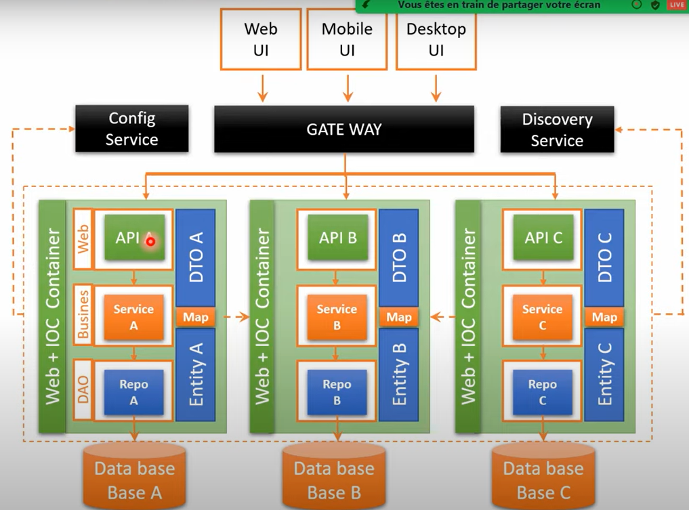
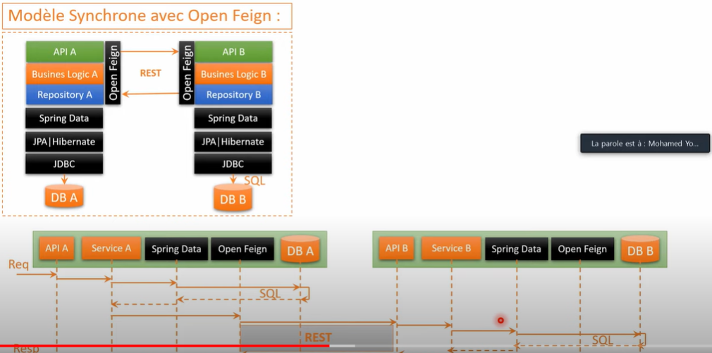

# Les Microservices
Le principe de l'architecture microservice est de découper un grand problème en un ensemble de petits problèmes, de les résoudre et bien sûr le decoupage se fait avec un niveau de granilarité beaucoup plus faible avec les besoins métiers.

## Défis
* faire Communiquer Les Applications Entre elles
  
* mettre en place un gate way qui permet aux applications clients de ne pas connaître les Adresses des applications qui constituent application microservice. Son rôle est l'acheminement des requests des clients vers nos différentes applications.

* Discovery Service qui va se charger d'enregistrer tous les microservices, c'est à dire chaque microservice qui est lancé il va enrégistrer
   1. son nom
   2. son adresse IP
   3. son numéro de port
   
* Config Service ce service permet de centraliser la configuration de tous les microservices, la première des choses à chaque fois que notre application demarre elle vérifie d'abord le service de configuration pour récuperer les fichiers des configuration des services puis elle les demarre. Grâce à elle quand on change la configuration d'un microservice on n'a pas besoin de redamerrer ou d'arrêter les autres services chaque microservice va recevoir sa configuration à chaud. 
  

## Les Avantages Des Microservices
* Performance (Scalabilité)
* Processus Séparés
* Facile à déveloper, à tester et à maintenir
* Mise en production rapide des microservices
* Redéploiement à chaud
* Technologies différentes
* Facile à appliquer l'agilité
* Facile à main en oeuvre TDD
* Equipes indépendantes

## Modèles De Gayway

## Modèle De Communication Entre Microservices
### Modèle Synchrone

### Modèle Asynchrone

## Security Challenge

### Stateful

### Stateless

## Comment Faire Avec Mes Données

meilleure solution

## Exemples Conception Microservices
